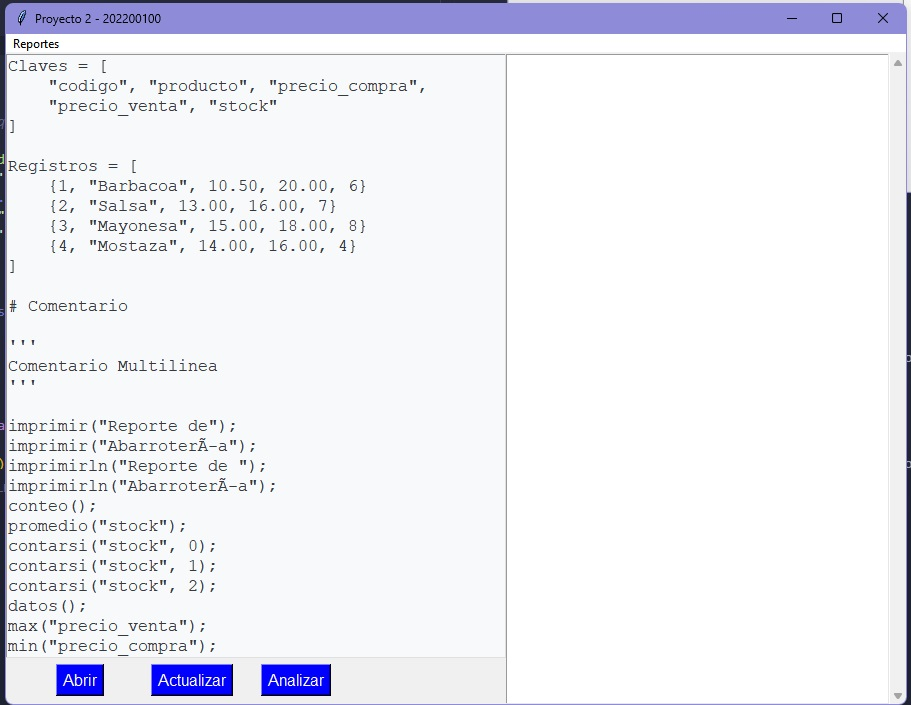
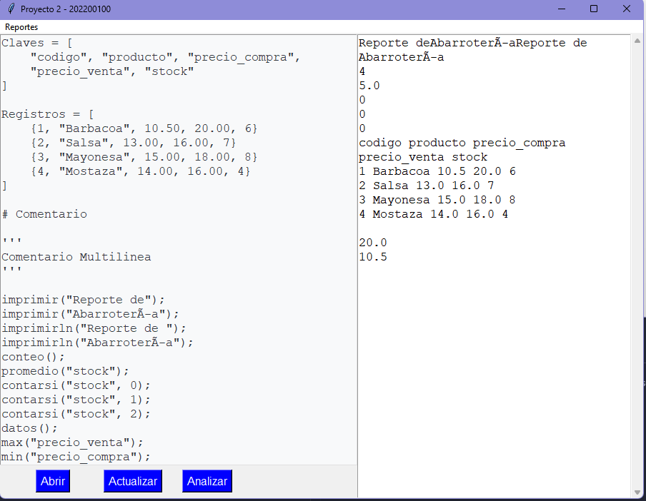
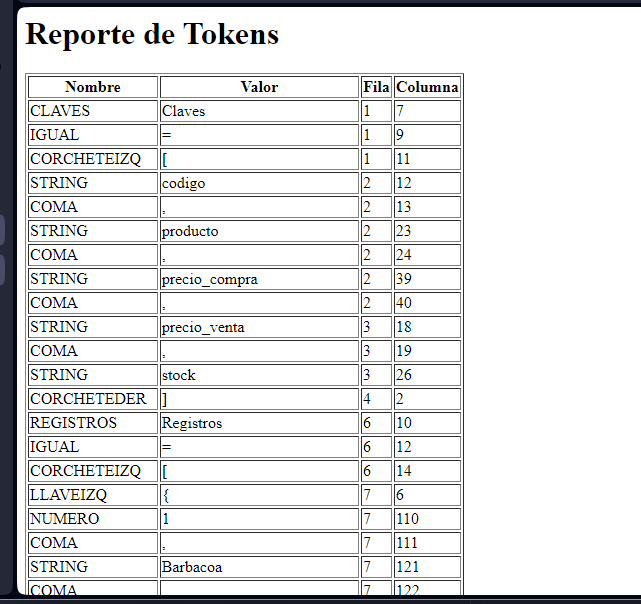
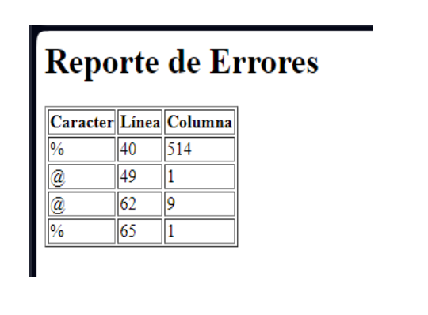

# Manual de usuario 
## Interfaz 
Lo primero que se ve al ejecutar el programa es un cuadro dividido, tres botones y un menú

### reportes 

este es un menú que despliega tres opciones, estas siendo:
### - Reporte de Tokens 
esta opción crea un archivo html que contiene  una tabla con todos los tokens en el texto que se le haya ingresado al programa.

### - Reporte de errores
esta opción crea un archivo html que contiene  una tabla con todos los erorres en el texto que se le haya ingresado al programa.

### - Arbol de derivación 
Esta opción grafica un arbol con todas las instrucciones y sus componentes 

## Botón abrir 
este hace que podamos seleccionar uno de los archivos con terminación bizdata que tenemos guardados en nuestro dispositivo

## Botón analizar 
Este botón llama a las funciones para que procesen el texto que se está mostrando en la parte izquierda 

## ejemplo del reporte de tokens

## ejemplo del reporte de errores 
